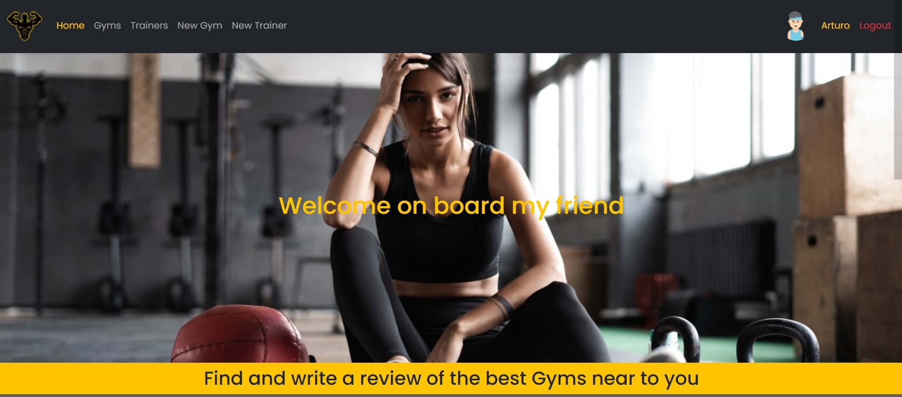
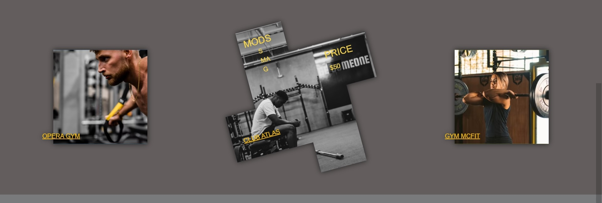
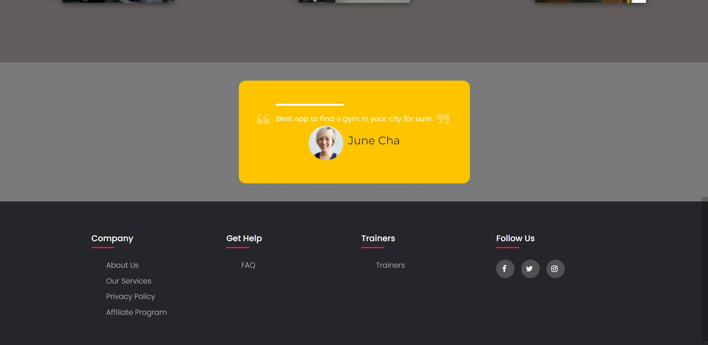
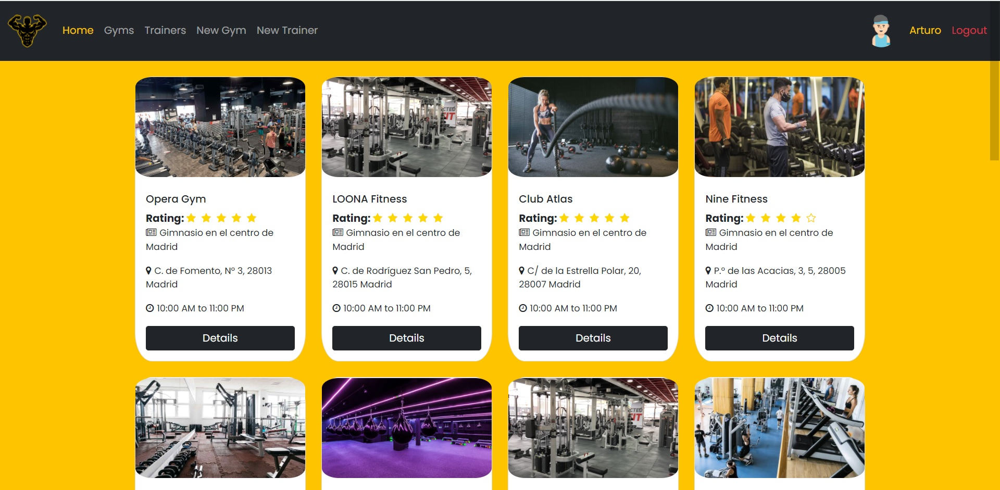
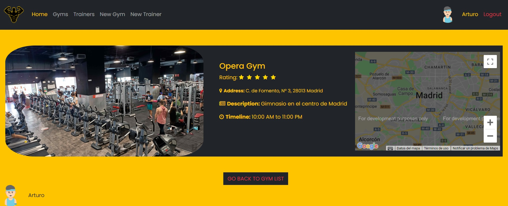
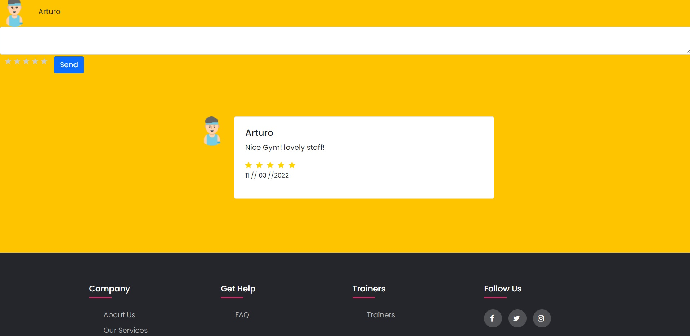
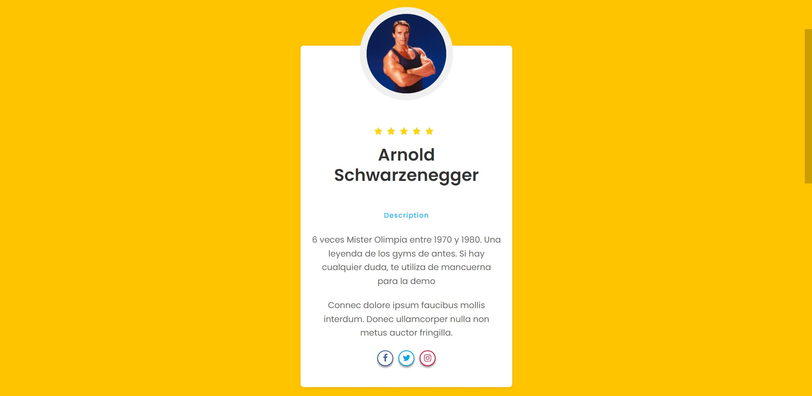

<!-- IRON GYM -->

# IRON GYM

## work in progress

### 📜 **what is the project about**

Is an app to find and write reviews about gyms and trainers.

You can promote your gym, and also your services as a trainer.

### Preview of the website

<h4>Programming Languages</h4>

  
  
  
  

  
   Back
</h3> 

  
  
  
  

<h4>Tools & Technologies</h4>

  
  

